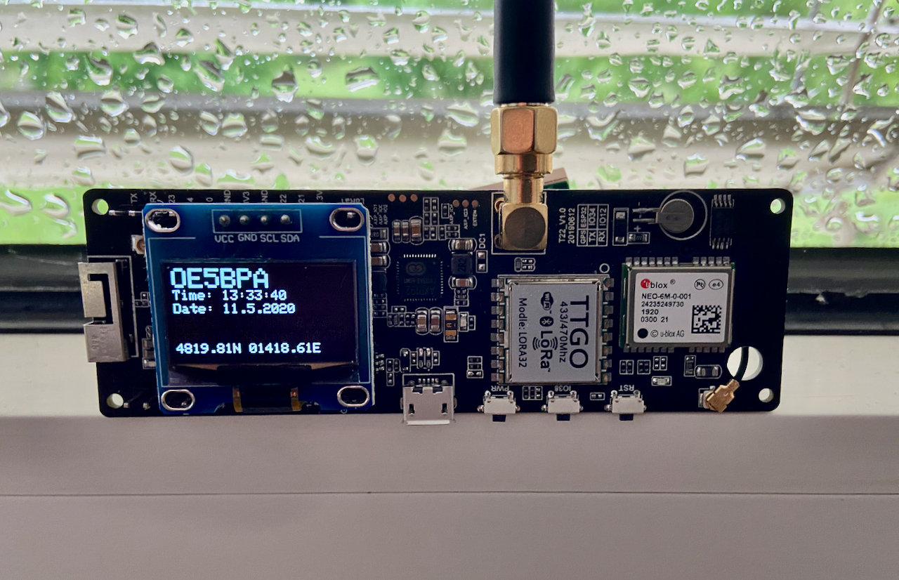

# LoRa APRS Tracker

The LoRa APRS Tracker will work with very cheep hardware which you can buy from amazon, ebay or aliexpress.
Try it out and be part of the APRS network.



## Supported boards

You can use one of the Lora32 boards:

* TTGO T-Beam V0.7 (433MHz SX1278)
* TTGO T-Beam V1.0 and V1.1 (433MHz SX1278)
* TTGO T-Beam V1.2 AXP2101 (433MHz SX1278)

This boards cost around 30 Euros, they are very cheap but perfect for an LoRa iGate.
Keep in minde: you need a 433MHz version!

## Compiling and configuration

**There is a german [quick start](https://www.lora-aprs.info/docs/LoRa_APRS_iGate/quick-start-guide/) page! Take a look ;)**

**There is a french [quick start](http://www.f5kmy.fr/spip.php?article509) page! Take a look ;)**

### How to compile

The best success is to use PlatformIO (and it is the only platform where I can support you). 

* Go to [PlatformIO](https://platformio.org/) download and install the IDE. 
* If installed open the IDE, go to the left side and klick on 'extensions' then search for 'PatformIO' and install.
* When installed click 'the ant head' on the left and choose import the project on the right.
* Just open the folder and you can compile the Firmware.


### Configuration

* You can find all nessesary settings to change for your configuration in **data/tracker.json**.
* The `button_tx` setting enables manual triggering of the beacon using the middle button on the T-Beam.
* To upload it to your board you have to do this via **Upload File System image** in PlatformIO!
* To find the 'Upload File System image' click the PlatformIO symbol (the little alien) on the left side, choos your configuration, click on 'Platform' and search for 'Upload File System image'.


#### Step on console

You may not need to use PlatformIO because compilation and configuration can be done via console.

```
# switch to virtual env, for example using pipenv
pipenv shell

# install platformio
pipenv install platformio

# upload to board
pio run -t upload
```


## LoRa iGate

Look at my other project: a [LoRa iGate](https://github.com/peterus/LoRa_APRS_iGate)
